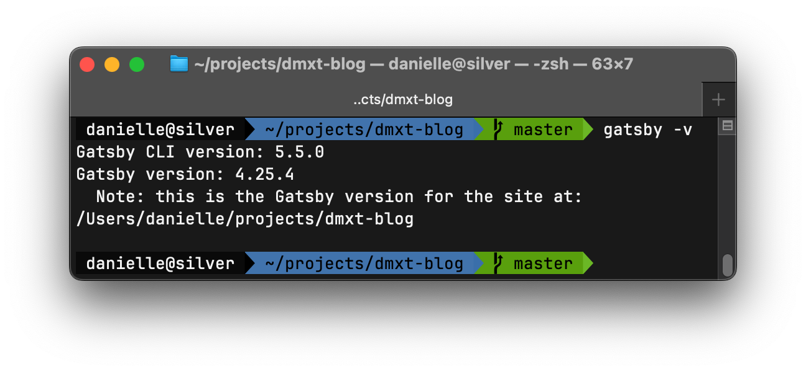

<p align="center">
  <a href="https://www.gatsbyjs.com">
    
  </a>
</p>
<h1 align="center">
  dmxt blog on Gatsby
</h1>
<p align="center">Open sourced</p>


##  Quick start 🚀

### 1. Install Gatsby on your system

    
1. If you use npm, run: `npm i -g gatsby-cli`
2. If you use yarn, run: `yarn global add gatsby-cli`
3. Check if Gatsby CLI is installed correctly by running: `gatsby -v`



**Note:** It does not need to have the exact same version as shown in a screenshot.

If it's not working, please open an [issue](https://github.com/dmxt/dmxt-blog/issues) on my repository or refer to an [official documentation](https://www.gatsbyjs.com/docs/tutorial/part-0/#gatsby-cli).

### 2. Pull a repository

Run the following:

    gatsby new my-blog-starter https://github.com/dmxt/dmxt-blog

You can change "my-blog-starter" to your preferred folder name. 
   

       
### 3. Start developing on live

Navigate into your new site’s directory and start it up with the following code:

```shell
gatsby develop
```

* Your site is now running at `http://localhost:8000`

* GraphQL is accessible at `http://localhost:8000/___graphql`. You can use this tool to experiment with querying your data.

If you can access your site on that link, then congratulations, you got it working! 🎉


### 4. Open the source code and start editing!

With the power of `gatsby develop` everything will be automatically updated on save.

If it's not working, please open an [issue](https://github.com/dmxt/dmxt-blog/issues) on my repository.


---

## 🧐 What's inside?

A quick look at the top-level files and directories you'll see in a Gatsby project.

    .
    ├── node_modules
    ├── src
    ├── .gitignore
    ├── .prettierrc
    ├── gatsby-browser.js
    ├── gatsby-config.js
    ├── gatsby-node.js
    ├── gatsby-ssr.js
    ├── LICENSE
    ├── package-lock.json
    ├── package.json
    └── README.md

1.  **`/node_modules`**: This directory contains all the modules of code that your project depends on (npm packages) are automatically installed.

2.  **`/src`**: This directory will contain all the code related to what you will see on the front-end of your site (what you see in the browser) such as your site header or a page template. `src` is a convention for “source code”.

3.  **`.gitignore`**: This file tells git which files it should not track / not maintain a version history for.

4.  **`.prettierrc`**: This is a configuration file for [Prettier](https://prettier.io/). Prettier is a tool to help keep the formatting of your code consistent.

5.  **`gatsby-browser.js`**: This file is where Gatsby expects to find any usage of the [Gatsby browser APIs](https://www.gatsbyjs.com/docs/reference/config-files/gatsby-browser/) (if any). These allow customization/extension of default Gatsby settings affecting the browser.

6.  **`gatsby-config.js`**: This is the main configuration file for a Gatsby site. This is where you can specify information about your site (metadata) like the site title and description, which Gatsby plugins you’d like to include, etc. (Check out the [config docs](https://www.gatsbyjs.com/docs/reference/config-files/gatsby-config/) for more detail).

7.  **`gatsby-node.js`**: This file is where Gatsby expects to find any usage of the [Gatsby Node APIs](https://www.gatsbyjs.com/docs/reference/config-files/gatsby-node/) (if any). These allow customization/extension of default Gatsby settings affecting pieces of the site build process.

8.  **`gatsby-ssr.js`**: This file is where Gatsby expects to find any usage of the [Gatsby server-side rendering APIs](https://www.gatsbyjs.com/docs/reference/config-files/gatsby-ssr/) (if any). These allow customization of default Gatsby settings affecting server-side rendering.

9.  **`LICENSE`**: This Gatsby starter is licensed under the 0BSD license. This means that you can see this file as a placeholder and replace it with your own license.

10. **`package-lock.json`** (See `package.json` below, first). This is an automatically generated file based on the exact versions of your npm dependencies that were installed for your project. **(You won’t change this file directly).**

11. **`package.json`**: A manifest file for Node.js projects, which includes things like metadata (the project’s name, author, etc.) This manifest is how npm knows which packages to install for your project.

12. **`README.md`**: A text file containing useful reference information about your project.

## 🎓 Documentation

Looking for more guidance? Full documentation for Gatsby lives [on the website](https://www.gatsbyjs.com/). Here are some places to start:

- **For most developers, we recommend starting with our [in-depth tutorial for creating a site with Gatsby](https://www.gatsbyjs.com/tutorial/).** It starts with zero assumptions about your level of ability and walks through every step of the process.

- **To dive straight into code samples, head [to our documentation](https://www.gatsbyjs.com/docs/).** In particular, check out the _Guides_, _API Reference_, and _Advanced Tutorials_ sections in the sidebar.