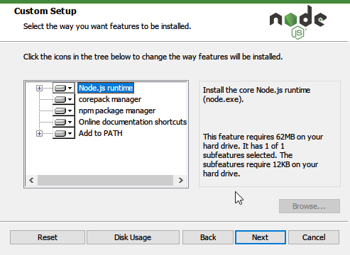

# What a disappointment!
Above cannot describe any further.

Text doesn't look right, but that's a mild inconvenience, but let's continue.

In order to develop this blog, we need the following:

```
1. git
2. npm or yarn
3. gatsby
4. IDE of your choice or vim
```

# How did I do it?

I can't install programs from commandline out of box. On MacOS, I literally can just open terminal and install `brew` and then install everything else I need for development.

Let's try the basic:
### 1. npm
The download button is not available on front-page, not available on `Ctrl+F` so I had to search on Google for a [download link](https://nodejs.org/en/download/) for installation.

Now! It's time to play the game called... "click next" "click next" "click next" "click next" "click next"



After 7 clicks, it's finally installed with only one advertisement.

The whole process took me 15 minutes of my time including searching for a download link.

### 2. Sorry I forgot what I need to install. My brain broke.
I need a break.