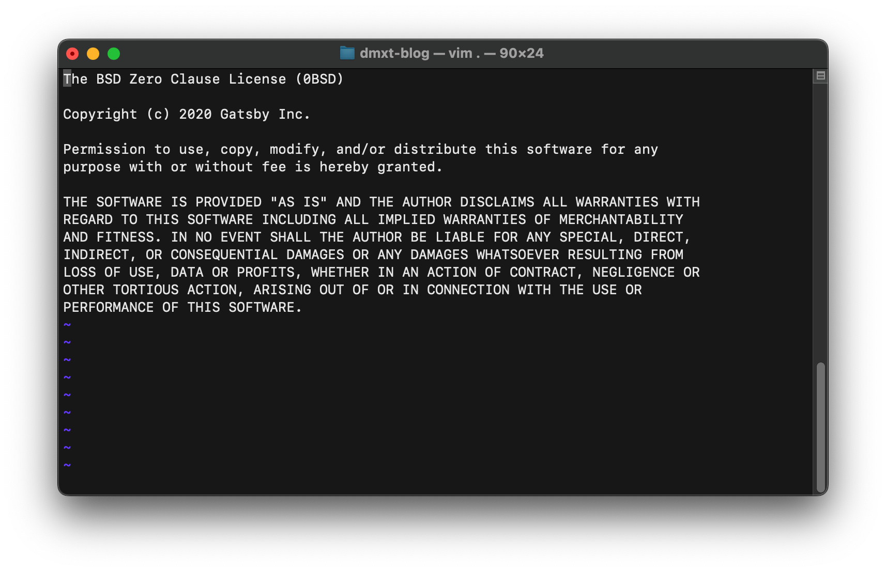
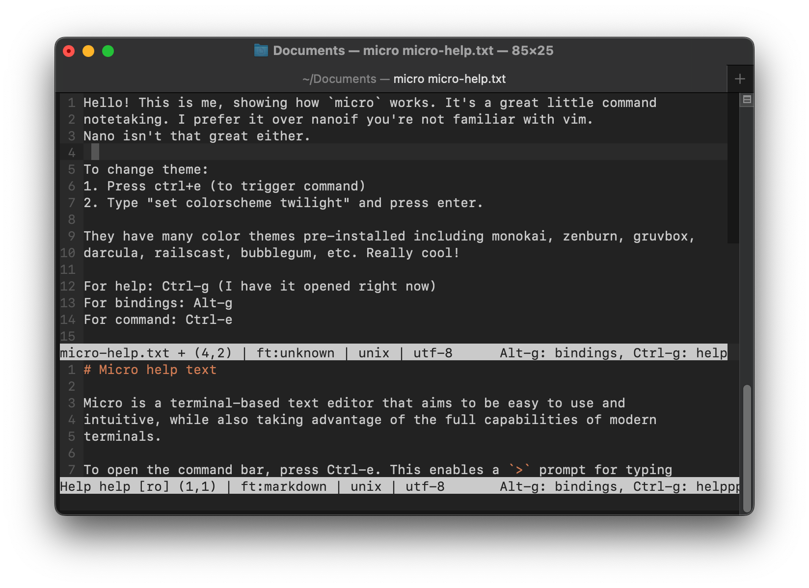
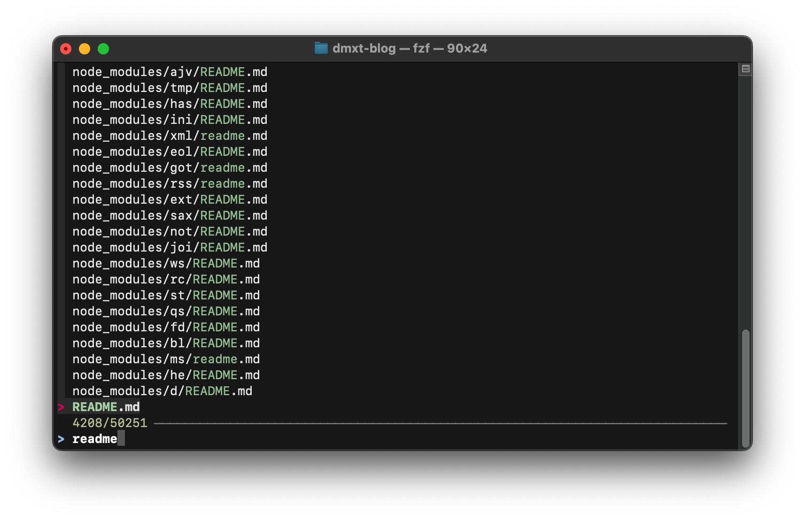
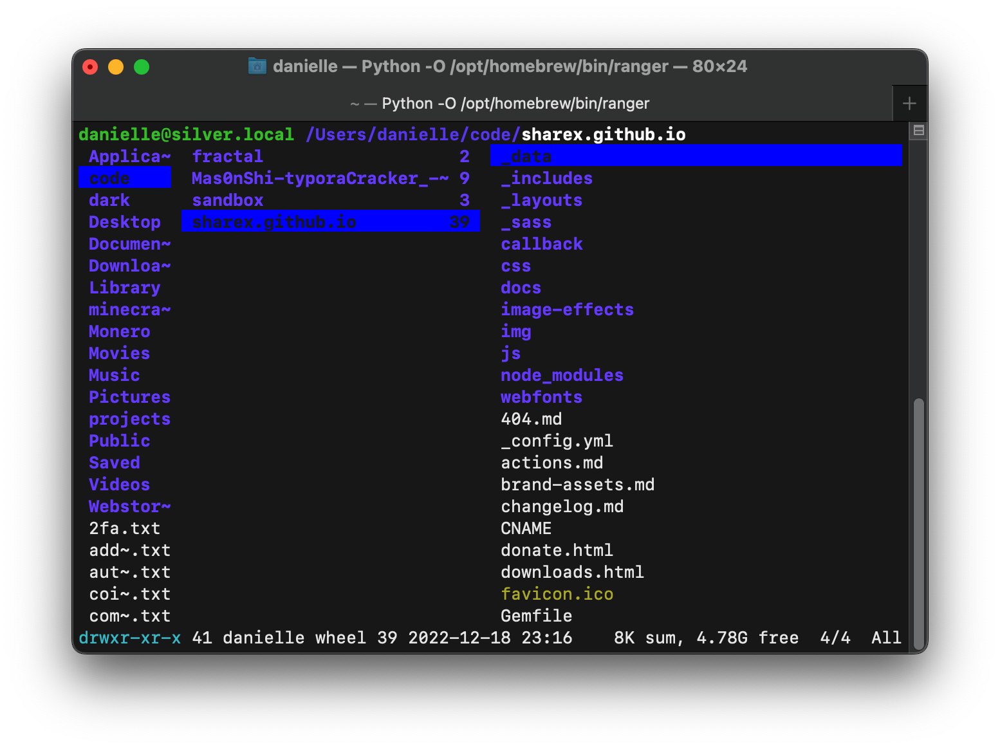

There are some apps you may already know about, and there may be some apps you don't know about. I plan to continuously
update this article.

Let me know what app you discovered from this article in a comment section below 😏

### Dear Windows users,

First of all, you need one good commandline software on your system. Powershell or cmd is not one of them.
Check out the following and see what you like the most:
* [cmder](https://cmder.app/) Super simple and nice
* [mintty](https://mintty.github.io/) Don't be afraid of the website, the software quality is excellent.
* [New Windows Terminal](https://github.com/microsoft/terminal) by Microsoft, they're making a new commandline.

Moving on from Windows users now. This blog is about UNIX-based system with a terminal.

# Text editors

### vim
This is the obvious one.

I've gotten so more productive by learning and using vim. 
Especially on Mac when you cannot right-click and create a new
text file in file explorer, or when you're connected to a server 
and want to modify a file on host, or on Linux with no GUI, 
so it's so much quicker to create a new file, use search function 
and get stuff done. It's worth it to learn basic shortcuts and go from there.

### How to install vim on:

- MacOS: `brew install vim`
- Ubuntu: `sudo apt-get install vim`
- Arch: `pacman -U vim`

I cannot emphasize this enough, it's really worth it to learn command line basic before you use vim like:
`cd`, `mkdir`, `touch`,`rm`,`rmdir`

You can learn [more terminal commands here](https://www.codecademy.com/learn/learn-the-command-line) and vim basic (like to move around, save, quit, adding new config like enable mouse to navigate around) vim have in-built tutorial to get you started or check out a YouTube video to get you up to speed.

I don't modify my vim like some people like to, I like to keep it plain and simple, and it does the job for me.

## micro (alternative)

If `vim` is too complicated for you, `nano` has too weird shortcut then...

`micro` would be a perfect fit for you. I like it more than nano, 
it comes with standard shortcuts like standard GUI editors like 
press `ctrl+w` to close, `ctrl+s` to save, `ctrl+f` for search function, 
etc. In additional, it comes with many themes.

You can [download micro right here](https://micro-editor.github.io/) and get started.

##### How to install in CLI:

- MacOS: `brew install micro`
- Ubuntu: `sudo apt-get install micro`
- Arch: `pacman -U micro`

# File explorers

### fzf

If you want to search for any file on your entre system, then `fzf` is a perfect fit for you. This software is amazingly fast at searching any filename on your system.

All you have to do is run `fzf` and it will list all files you have your system
and a search function.

#### How to install:

- MacOS: `brew install fzf`
- Ubuntu: `sudo apt-get install fzf`
- Arch: `pacman -U fzf`

## ranger

Very powerful file explorer you can use inside your commandline, and it functions like a regular file 
explorer. This is useful if you do not have access to GUI file explorer like accessing a server commandline.

#### How to install:

- MacOS: `brew install ranger`
- Ubuntu: `sudo apt-get install ranger`
- Arch: `pacman -U ranger`
