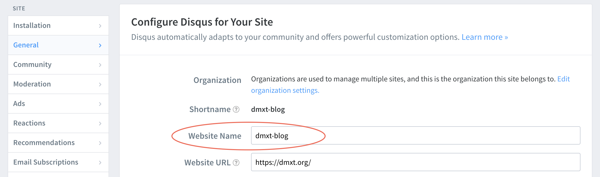

I like using Disqus because it's simple to setup and simple for anyone to place a comment.
Some people dislike it for security reasons.

Some articles don't work at all, so I found this working method to add comment sections to my blog articles and this should work for you too!


# 1. Disqus configuration

1. Login (or register) on https://disqus.com/
2. Go to https://disqus.com/admin/install/ and click on Gatsby in the list
3. Start configuring Disqus for "Your site" similar to the following:

Remember your entry for "Website Name:" field, circled, you'll need it to put it in a config later.

# 2. Installation
**A. Install on `npm`**
1. Stop `gatsby develop`
2. Run `npm install react-disqus-comments`

**B. Install on `yarn`** (preferred)
1. Stop `gatsby develop`
2. Run `yarn add react-disqus-comments`

## 3. Set it up on your Gatsby website

Run `gatsby develop` to start your Gatsby up and running in localhost.

#### Then add this section where you want the comment section to be. 

Add the following to your blog article template (in my case `src/templates/pages/blog-post`), if you want to put it on the bottom of your article, then put it in bottom.  In my case, it will be on the very bottom before `</Layout>`

```javascript
<ReactDisqusComments
  shortname="dmxt-blog"
  identifier={post.id}
  title={post.title}
  url={post.url}
  category_id={post.category_id}
/>
```
Replace `shortname` to your blog name configured in Disqus website.

# 4. Restart Gatsby to test
Try re-compiling it by stopping the environment dev, and starting it back up with 
`gatsby develop`

Your Disqus comment section should show up on localhost environment if configured correctly.
