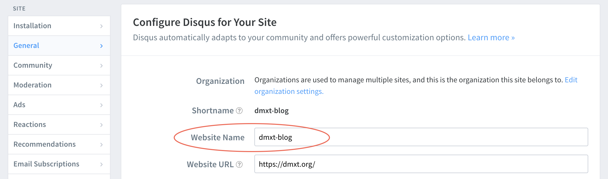

Some articles don't work at all, so I found this working method to add comment sections to my blog articles. 


# 1. Registering Disqus:

1. You have to register a new (or pre-existing) account before setup. Link: https://disqus.com/admin/install/
2. Start configuring Disqus for "Your site" similar to the following:

Remember the "Wesite Name" field, you'll need it to enter in a config

# 2. Installation:
**A. Install on `npm`**
1. Stop `gatsby develop`
2. Run `react-disqus-comments` (???)
3. Run `npm install react-disqus-comments`

**B. Install on `yarn` (preferred)**
1. Stop `gatsby develop`
2. Run `yarn add react-disqus-comments`

## 3. Restart your Gatsby site:

Run `gatsby develop` to start your Gatsby up and running in localhost.

#### Then add this section where you want the comment section to be. 

Add the following to your blog article (in my case `src/templates/pages/blog-post`)
In my case, it will be on the very bottom before `</Layout>`

```react
<ReactDisqusComments
  shortname="your_short_name"
  identifier={post.id}
  title={post.title}
  url={post.url}
  category_id={post.category_id}
/>
```

Change `website-name` from "Website Name:" field when configurirng the official Disqus, in my example

```react
  shortname="dmxt-blog"
```

### Restart Gatsby to activate the comment section
Try re-compiling it by stopping the environment dev, and starting it back up, your Disqus comment section should show up even on localhost environment, if correctly configured.