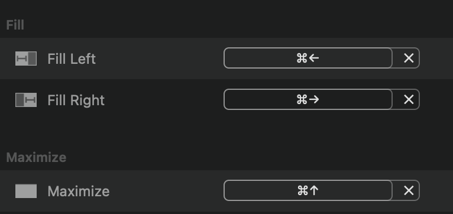
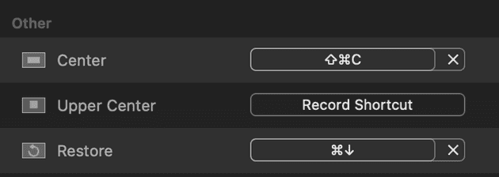

**I do not get paid to post this! This is my opinion piece and the developer of this software doesn't know that I wrote this article in his behalf.**

# What is Window Manager?

First, you need to know that Windows made the exact same concept, but they patented it so
Apple can't put it on their system. So I started my search for a good window manager for macOS and found Rectangle.

## About Rectangle

After discovering Rectangle, I enjoy using Mac a lot more. It does much more than Windows,
and it's being actively developed as of writing.

Rectangle is by far the most powerful windows manager I've ever used. Rectangle is #1 in my opinion. I can press ⌘→ move a window to the right or ⌘← to move a window. There is much more you can do with this powerful app.

**Rectangle changed my life significantly and improves productivity and a lot of joy. 👏🏻**

## Download

https://rectangleapp.com/pro

It has a free trial for 10 days and $9.99 for permanent license for 3 devices.

### Reconfiguring Rectangle

I didn't particularly like their default config proposal, so I reconfigured same keyboard shortcut as configured on Windows, and I'm very happy with this workflow. This config makes most sense and easy to remember. It's up to you the way how you like to configure it.

I only use four shortcuts (Fill Left, Fill Right, Maximize and Reverse).

I configured the following:

- **⌘→ (Fill Left)** Move window to left
- **⌘← (Fill Right**) Move window to right
- **⌘↑ (Maximize)** Move window to maximized state
- **⌘↓ (Restore)** Restore (undo) the window to original state

I made a screenshot of my Rectangle configuration, personally I mainly use four (left, right, maximize and restore) and few more:

They have so much more cool functions you can find what is useful to be more productive.

For instance, if you want gaps between windows, you can turn it on and adjust the gap width. Like mentioned before, there are many functions you may find it useful for your workflow.
