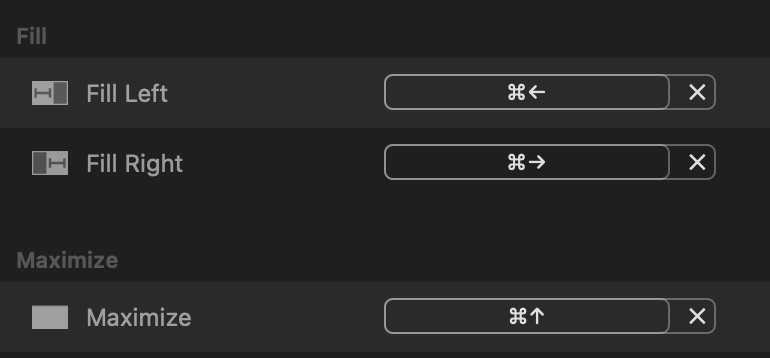
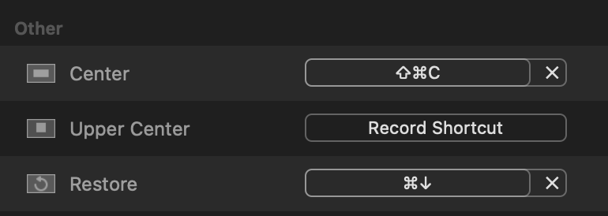

# Rectangle

**Reminder! I do not get paid to post this, this is my opinion article in support for this software!**

## What is Rectangle?

First, you need to know that Windows made the exact same concept, but they patented it so
Apple can't put it on their system.

Rectangle is the most amazing windows manager. Pressing ⌘→ or ⌘← to move a window halfway on either side.

Windows has it all pre-built, but Apple is not allowed to implement it,
so we have to use 3rd-party-software to simplify our life and be more productive.

#### When I found out about Rectangle, it changed my life significantly and improves productivity and enjoyment.

# Download

https://rectangleapp.com/pro

It has a free trial for 10 days and $9.99 for permanent right.

### Reconfiguring Rectangle

I didn't particularly like their default config proposal, so I reconfigured same keyboard shortcut as configured on Windows,
and I'm very happy with this workflow. This config makes most sense and easy to remember.

It's up to you the way how you like to configure it.

## My configuration

I only use four shortcuts (Fill Left, Fill Right, Maximize and Reverse).

I configured the following:

- **⌘→ (Fill Left)** Move window to left
- **⌘← (Fill Right**) Move window to right
- **⌘↑ (Maximize)** Move window to maximized state
- **⌘↓ (Reverse)** Reverse the window to original state

I made a screenshot of my Rectangle configuration, personally I use top four.

They have so many cool functions you can find what is useful to be more productive.

---

# Information

### What is a WM?

Window Manager (WM) is a software that controls placement of windows.
A good WM software help you place windows on your screen with easy keyboard shortcuts.
It speeds up the workflow a lot and increase productivity.

---

**Windows** already have a decent WM prebuilt. There isn't very good 3rd party WM choice.

**Linux** come with many different WM choices, not all of them is very good. It requires a lot of configuration to make it function decently.

**MacOS** doesn't have pre-built shortcut for windows management, because Microsoft patented it
against them.

# Conclusion: Rectangle is an awesome WM!

After discovering Rectangle, I enjoy using Mac a lot more. It does much more than Windows,
and it's being actively developed as of writing.
